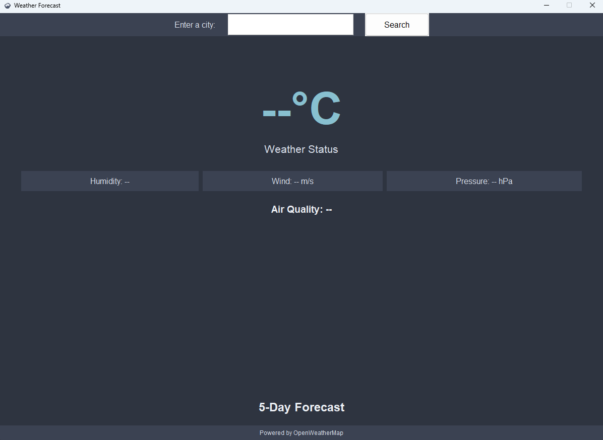
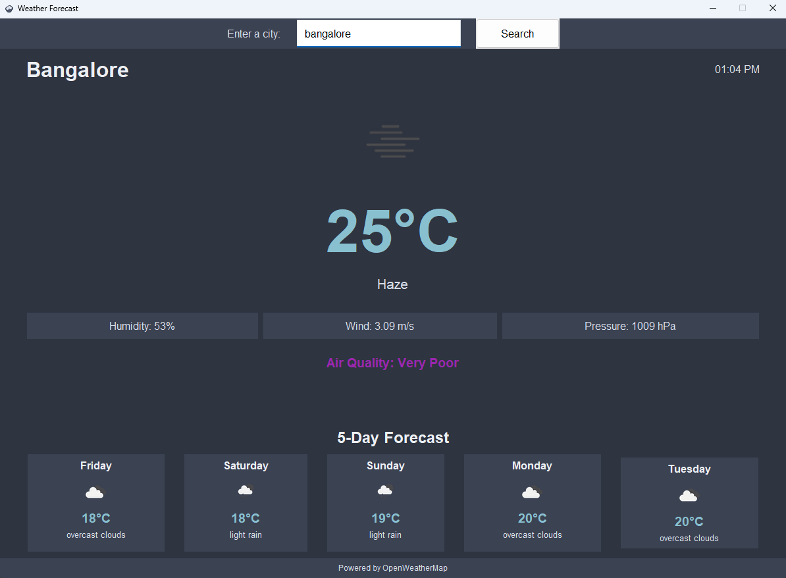

# Weather Forecasting App 🌤️

A beautiful, dark-themed weather application that provides current weather conditions, air quality information, and 5-day forecasts for cities worldwide.

## Features 🌟

- **Real-time Weather Data**: Get up-to-date weather information using the OpenWeatherMap API
- **Air Quality Index**: Monitor air quality with color-coded indicators
- **5-Day Forecast**: Plan ahead with detailed 5-day weather predictions
- **Dark Theme**: Easy on the eyes with the elegant Nord color palette
- **Interactive UI**: Smooth animations and hover effects for better user experience
- **Responsive Design**: Clean and modern interface that adapts to content

## Screenshots 📸

### Default View
When you first open the app, you'll see this interface:

### Weather View
After selecting a city, the app displays detailed weather information:

## Installation 💻

1. Download the latest `WeatherApp.exe` from the `dist` folder
2. Place it anywhere on your computer
3. Double-click to run - no installation required!

## How to Use 🚀

1. Launch the application by running `WeatherApp.exe`
2. Enter a city name in the search bar
3. Press Enter or click the Search button
4. View detailed weather information including:
   - Current temperature
   - Weather condition
   - Humidity
   - Wind speed
   - Air pressure
   - Air quality index
   - 5-day forecast

## Technical Details 🔧

- Built with Python 3.12
- Uses Tkinter for the GUI
- Integrates with OpenWeatherMap API
- Features a custom-designed cloud icon
- Implements smooth card animations
- Uses the Nord color theme for consistent styling

## Dependencies 📦

- tkinter: GUI framework
- requests: API communication
- PIL (Pillow): Image processing
- datetime: Time calculations
- python-dotenv: Environment management

## Color Scheme 🎨

Uses the Nord theme palette:
- Background Dark: #2E3440
- Background Light: #3B4252
- Text Light: #ECEFF4
- Text Dim: #D8DEE9
- Accent: #88C0D0

## API Integration 🔌

The app uses the following OpenWeatherMap API endpoints:
- Current Weather Data
- 5 Day Weather Forecast
- Air Pollution Data

## Error Handling ⚠️

- Displays user-friendly error messages
- Handles network connectivity issues
- Validates city input
- Manages API response errors

## Contributing 🤝

Feel free to fork this repository and submit pull requests for any improvements.

## License 📄

This project is open source and available under the MIT License.

## Author ✍️

Created with ❤️ using Python and Tkinter.

---
*Note: Make sure you have a stable internet connection for real-time weather updates.*
